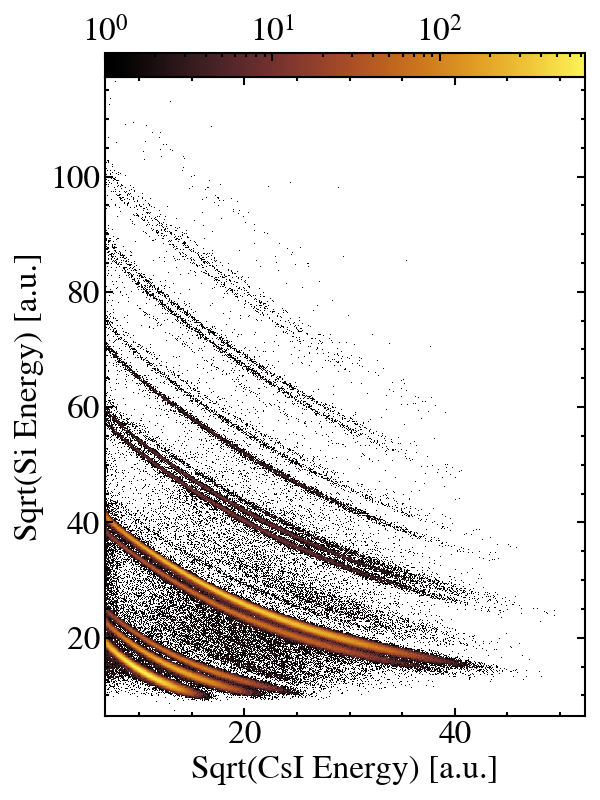
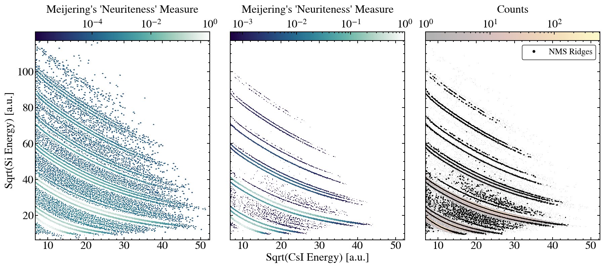

# I have to write this yet

## Initializing your data
For whatever detector data you are trying to linearize, there should be a dedicted directory. 
For instance, `/path/to/calib_data/faust_det_60`. 

Inside of `faust_det_60` there should be a file `raw.parquet` which contains the two dimensional data that you wish to linearize. It is highly recommended that the user spends soem time transorming that data such that curvature of the data is minimized. 
For example, in $\Delta E$ vs $E$ data, I recommend taking the square root of both signals.
If you are coming from `ROOT`, consider the `hepconvert` tool to convert your files to the necassary `parquet`.

There should also be a `params.dat` file, which can be copied from `params-template.dat`. There are descriptions of all of the parameters for each of the steps in the template file, and most of the parameters will also be described below. Having this parameter file mitigates the need to have to pass options to every script and avoid (some) confusion.

## Preparing to Point Pick

### What to do
`python py/find_ridges.py [DIRECTORY] [-p PLOT]`
The directory option for this step and all other scripts should point to the same directory described above. In the running example `/path/to/calib_data/faust_det_60/`.

The `-p` option just plots the results of this step.  

### What is happening 
The raw data is plotted as part of a 2D histogram (number of x and y bins are parameters) so that the `meijering` ridge detection algorithm can be used (see https://scikit-image.org/docs/stable/api/skimage.filters.html).
This requires a kernel size (sigma parameter) for assessing smoothed derivatives of the image. 
Techinically speaking, this filter function only returns a "neuriteness" measure of every pixel. A threshold (one of the parameters) is then used to select the pixels which are neurite-like. Finally a very basic non-maximum-suppression algorithm is usede to thin out the selected ridges. 

